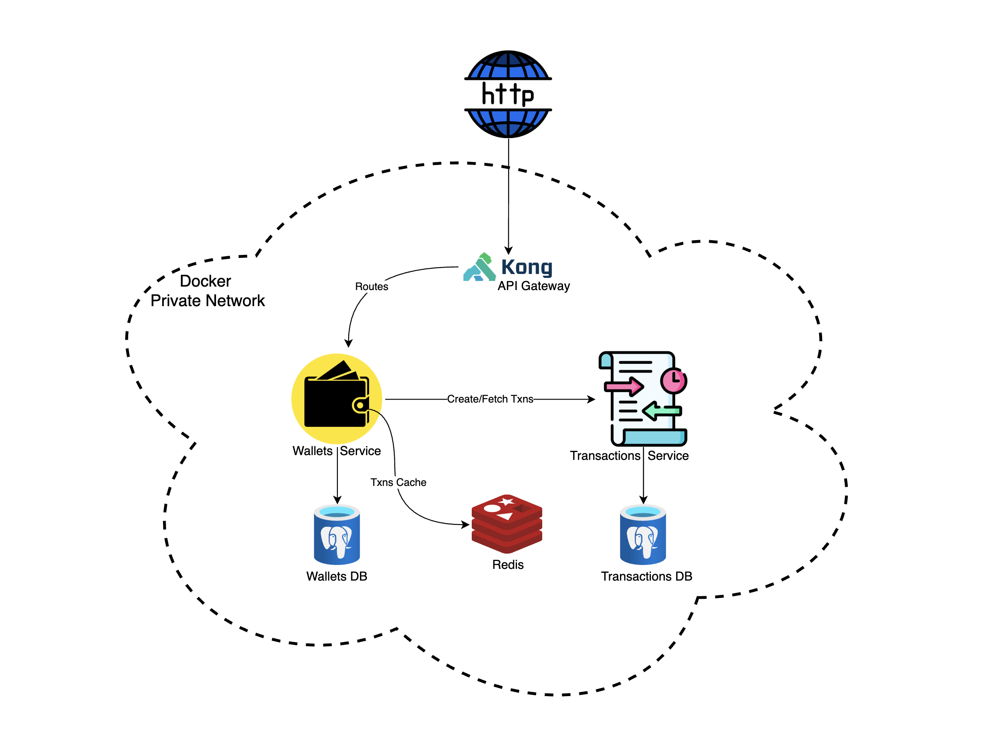

# Digital Wallet Demo - Scalable Fintech Backend

[](https://golang.org/)
[]()
[]()
[]()

A production-ready, scalable digital wallet system built with Go microservices architecture, featuring high-performance transaction processing, comprehensive testing, and enterprise-grade reliability.

<!-- How they work together

User makes a deposit via /wallets/deposit → hits Wallet Service

Wallet Service:

Adds money to user balance in DB

Optionally updates Redis cache

Sends a request/event to Transactions Service to log the operation

Transactions Service stores the full transaction:

Amount, type (deposit/withdraw/transfer), timestamp, user_id

When user checks /wallets/ for history, Wallet Service can either:

Read from its own DB (if it keeps history)

Or query Transactions Service for full detailed history -->

## System Architecture

<p align="center">
  
</p>

## 🛠️ Technology Stack

- **Backend**: Go 1.24+ with Echo framework
- **Database**: PostgreSQL 15+ with GORM ORM
- **Cache**: Redis 7 with connection pooling
- **API Gateway**: Kong 3.6 with rate limiting
- **Documentation**: Swagger/OpenAPI 3.0
- **Containerization**: Docker & Docker Compose
- **Testing**: Go testing + Testify + gotestsum
- **CI/CD**: GitHub Actions with automated testing

## 📋 Prerequisites

- **Go**: 1.24 or higher
- **Docker**: 20.10+ with Docker Compose
- **Make**: Build automation
- **Git**: Version control

## 🚀 Quick Start

### 1. Clone and Setup
```bash
git clone https://github.com/fardinabir/digital-wallet-demo.git
cd digital-wallet-demo
```

### 2. Start All Services
```bash
# Start complete microservices stack
make dev

# This command will:
# - Clean any existing containers
# - Start PostgreSQL, Redis, Kong, and both services
# - Run database migrations
# - Setup provider wallets
```

### 3. Verify APIs
```bash
# Check all service health
make test
# This will run all unit tests and integration tests
```

### 4. Access API Details

**Swagger UI Access:**
- **Exposed endpoints**: http://localhost:1314/swagger/index.html
- **Kong Gateway**: http://localhost:8000/ (API endpoints)

## 📚 Documentation

Detailed documentation is available for specific components:

### 🎯 Design Pattern Documentation
- **[Design Patterns & Concurrency](design_patterns_concurrency.md)** - Comprehensive guide to design patterns and concurrency mechanisms implemented across the system

### 📄 Component Documentation
- **[Kong API Gateway](KONG_API_DOCUMENTATION.md)** - API routes, rate limiting, and usage examples
- **[Redis Performance](REDIS_PERFORMANCE.md)** - Caching strategy, performance metrics, and optimization
- **[Wallet Database Schema](services/wallets/DATABASE_SCHEMA.md)** - Wallet service database design
- **[Transaction Database Schema](services/transactions/DATABASE_SCHEMA.md)** - Transaction service database design
- **[Wallet Service Setup](services/wallets/DATABASE_SETUP.md)** - Service-specific setup guide
- **[Transaction Service Setup](services/transactions/DATABASE_SETUP.md)** - Service-specific setup guide

## 🔄 Test the System

```bash
# Health check for wallet service
curl -X 'GET' \
  'http://localhost:8000/health' \
  -H 'accept: application/json'

# Create a test wallet
curl -X POST http://localhost:8000/users \
  -H "Content-Type: application/json" \
  -d '{"user_id": "test-user", "acnt_type": "user"}'

# Deposit funds
curl -X POST http://localhost:8000/wallets/deposit \
  -H "Content-Type: application/json" \
  -d '{"user_id": "test-user", "amount": 10000}'

# Check balance
curl http://localhost:8000/wallets/test-user

# Transfer funds (create second user first)
curl -X POST http://localhost:8000/users \
  -H "Content-Type: application/json" \
  -d '{"user_id": "test-user-2", "acnt_type": "user"}'

curl -X POST http://localhost:8000/wallets/transfer \
  -H "Content-Type: application/json" \
  -d '{"from_user_id": "test-user", "to_user_id": "test-user-2", "amount": 2500}'
```


## 🚀 Key Features & Performance Highlights

### 🏎️ High-Performance Architecture
- **Concurrent Processing**: Go routines for parallel transaction fetching from microservices
- **Race Condition Protection**: Thread-safe operations with proper synchronization
- **Redis Caching**: 90%+ cache hit ratio, reducing response times from 150ms to 5ms
- **Connection Pooling**: Optimized database connections for high throughput

### 📈 Scalability & Microservices
- **Horizontal Scaling**: Independent service scaling based on load
- **Load capable**: Kong API Gateway with rate limiting (300 req/min)
- **Database Seperation Ready**: Separate service databases with shared infrastructure
- **Load Distribution**: Redis cache reduces inter-service communication by ~90%

### 💰 Financial-Grade Transaction Processing
- **ACID Compliance**: Atomic transactions with rollback capabilities
- **Double-Entry Bookkeeping**: Complete audit trail for all financial operations
- **Concurrent Transaction Safety**: Prevents race conditions in balance updates
- **Real-time Balance Consistency**: Immediate balance updates across services

### 🧪 Comprehensive Testing & Quality
- **93.3% Test Coverage**: Extensive unit, integration, and end-to-end tests
- **CI/CD Pipeline**: Automated testing and linting with GitHub Actions
- **Code Quality**: golangci-lint integration with 15+ linters


## 🔧 Development Commands

```bash
# Start the system
make dev              # Complete development setup
make up               # Start all services
make down             # Stop all services

# Testing
make test             # Run all tests
```

## 🔒 Security & Compliance

### Current Implementation
- Input validation on all endpoints
- SQL injection prevention via GORM
- Rate limiting via Kong Gateway
- Transaction atomicity and consistency
- Double-entry Book-keeping like standard financial systems

### Production Recommendations
- Deployment in K8s with secure secrets management
- JWT authentication and authorization
- TLS encryption for all communications
- Database encryption for sensitive data
- Advanced monitoring and alerting

## 📄 License

This project is licensed under the MIT License - see the [LICENSE](LICENSE) file for details.


**Quick Links:**
- 🔧 [API Documentation Swagger](http://localhost:1314/swagger/index.html)
- 💳 [Wallet Database Schema](services/wallets/DATABASE_SCHEMA.md)
- 🛠️ [Transaction Database Schema](services/transactions/DATABASE_SCHEMA.md)
- 📊 [Design Overview](design_patterns_concurrency.md)
- 🛡️ [API Guide](KONG_API_DOCUMENTATION.md)
